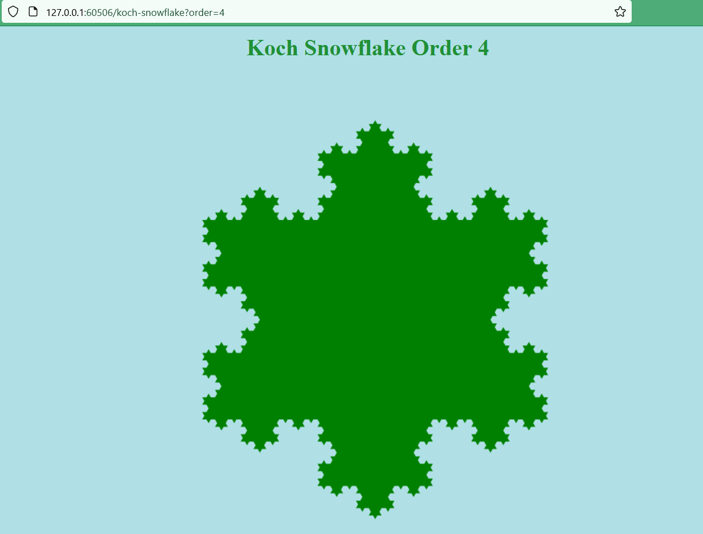

# kubernetes-fractal-website
A website that runs on Docker and Kubernetes which displays fractals, such as the Koch Snowflake.

## How to Deploy Using Minikube and Docker

### 1. Install Docker
Install Docker on your local machine.

### 2. Install Minikube and Kubectl
Install Minikube and Kubectl on your local machine. Minikube will allow you to create a local installation of a Kubernetes cluster on your computer, while Kubectl will allow you to interact with the cluster.

### 3. Create a Kubernetes Cluster
Create a basic one-node cluster using Docker as the driver.

In Powershell (admin mode):
```pwsh 
minikube start --driver=Docker
```

### 4. Build a Docker Image of the Website
Select the minikube environment for docker, so that minikube can access local images directly.

Run
```pwsh
& minikube -p minikube docker-env --shell powershell | Invoke-Expression
```
Next, to build the image, navigate to *flask-website* directory and run
```pwsh
docker build -t fractals-website .
```

### 5. Create Kubernetes Deployment
Navigate to *Kubernetes* directory and run
```pwsh
kubectl create -f fractals-website-deployment.yaml
```
### 6. Expose Kubernetes Deployment via Nodeport Service
Run
```pwsh
kubectl create -f fractals-website-service.yaml
```

### 7. Create a Service Tunnel
In order to access the website from outside the minikube cluster run this command in a separate terminal, which you have to keep open
```pwsh
minikube service fractals-website-service --url
```

### 8. Demo the Website


