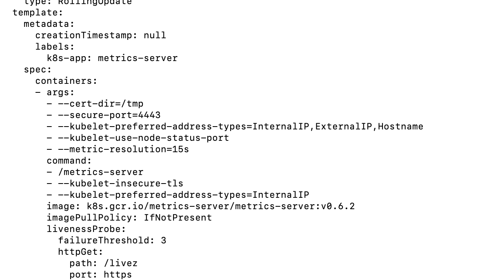

# kubernetes-fractal-website
A website that runs on Docker and Kubernetes which displays fractals, such as the Koch Snowflake.

## How to Deploy Using Minikube and Docker

### 1. Install Docker
Install Docker on your local machine.

### 2. Install Minikube and Kubectl
Install Minikube and Kubectl on your local machine. Minikube will allow you to create a local installation of a Kubernetes cluster on your computer, while Kubectl will allow you to interact with the cluster.

Mac:
```Terminal
brew install minikube
```
Make life easier when using minikube's kubectl.
```Terminal 
alias kubectl="minikube kubectl --"
```

### 3. Create a Kubernetes Cluster
Create a basic one-node cluster using Docker as the driver.

Windows:
In Powershell (admin mode):
```pwsh 
minikube start --driver=Docker
```

Mac:
```Terminal
minikube start
```

### 4. Build a Docker Image of the Website
Build a docker image and push it to docker hub repository.

```
docker build -t username/fractals-website:vx.x.x .
docker push username/fractals-website:vx.x.x
```

### 5. Create Kubernetes Deployment
Navigate to *Kubernetes* directory and run
```
kubectl create -f fractals-website-deployment.yaml
```
### 6. Expose Kubernetes Deployment via Nodeport Service
```
kubectl create -f fractals-website-service.yaml
```

### 7. Create a Service Tunnel
In order to access the website from outside the minikube cluster run this command in a separate terminal, which you have to keep open.
```
minikube service fractals-website-service
```

### 8. Demo the Website


## Horizontal Autoscaling

### 1. Install Metrics Server
```
kubectl apply -f https://github.com/kubernetes-sigs/metrics-server/releases/latest/download/components.yaml
```
Edit components.yaml
```
kubectl edit deployment -n kube-system metrics-server
```
Copy and paste the below code where shown.
```
command:
- /metrics-server
- --kubelet-insecure-tls
- --kubelet-preferred-address-types=InternalIP
```

```
kubectl apply -f ./components.yaml
```
Restart minikube.

### 2. Create HorizontalPodAutoscaler (hpa)
Specify the maximum average cpu load (%) on a pod and the minimum and maximum number of pods.
```
kubectl autoscale deployment fractals-website --cpu-percent=50 --min=1 --max=10
```
### 3. Apply Load Using busybox
Create a busybox pod to send requests to the service periodically.
```
kubectl run -i --tty load-generator --rm --image=busybox:1.28 --restart=Never -- /bin/sh -c "while sleep 0.5; do wget -q -O- http://{service cluster IP}:{service IP}/koch-snowflake?order=n; done"
```

Obtain Cluster IP of the Service.
```
kubectl describe service fractals-website-service
```
### 4. Watch the Autoscaler
In a separate terminal watch the autoscaler in action.
```
kubectl get hpa fractals-website --watch
```